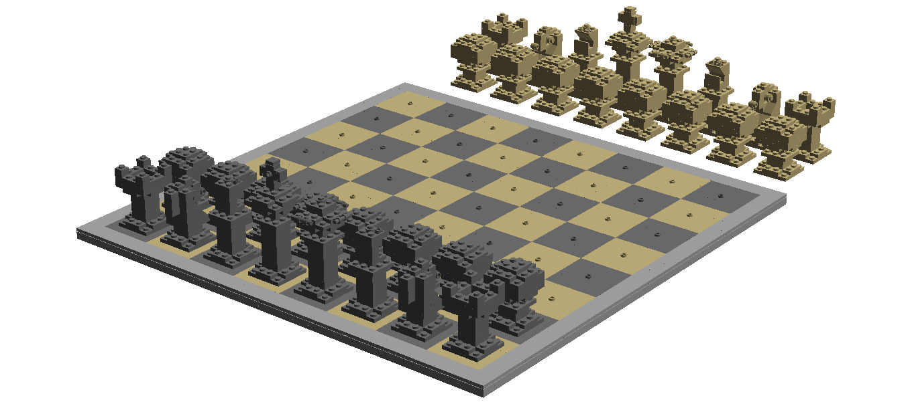

Chess Set
=========
I believe this was my second creation using LDD (second to a Rubik's Cube that
was far too large to function properly). I made this back in the fall of 2010.
I have never built a physical model.

Files
-----
* [chess-set.xml](./chess-set.xml) - Bricklink XML mass upload file
* [chess-set.lxf](./chess-set.lxf) - LDD file
* [chess-set.ldr](./chess-set.ldr) - LDraw file

License
-------
Copyright 2010 Bezeredi, Evan D.
