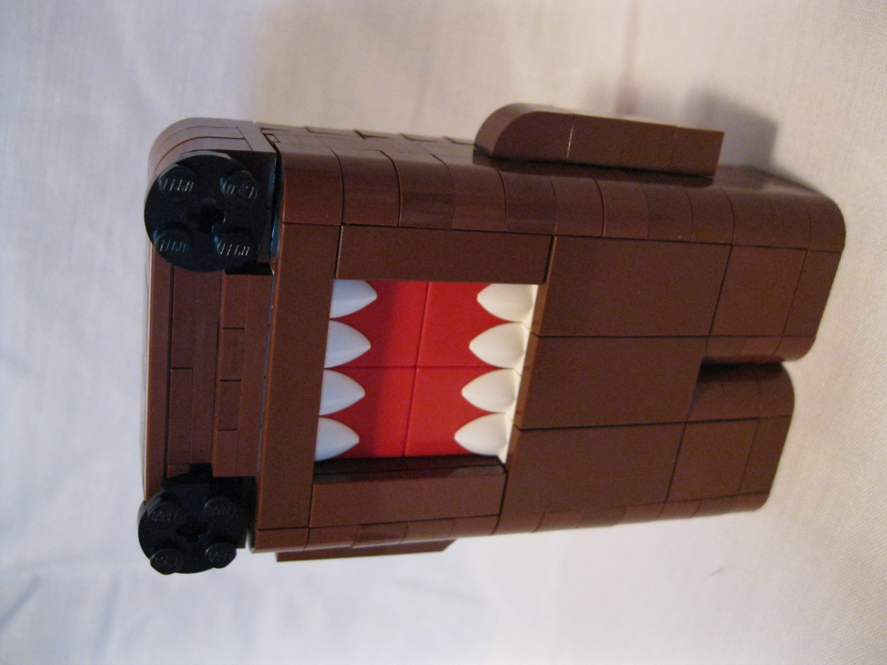

Domo
====
I believe this was my second creation using LDD (second to a Rubik's Cube that
was far too large to function properly). I made this back in the fall of 2010.
I have never built a physical model.

Files
-----
* [domo.xml](./domo.xml) - Bricklink XML mass upload file
* [domo.lxf](./domo.lxf) - LDD file
* [domo.ldr](./domo.ldr) - LDraw file

License
-------
Copyright 2012 Bezeredi, Evan D.

All files are free to use provided that credit is given where it is due as well
as a link back to this page.
