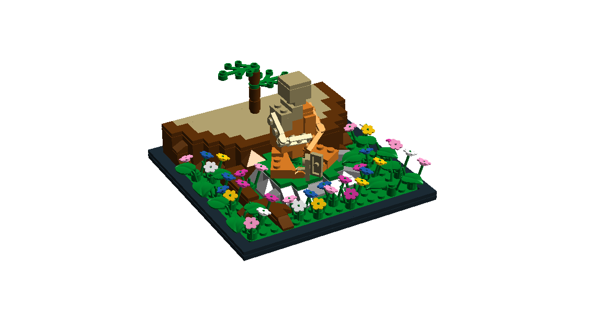

Enlightened
===========
I wanted to make a model of a monk meditating beneath a tree. I find trees
difficult to model so I only did the base of the tree such that it had been cut
down. I also added a sapling to the middle of the base.

Files
-----
* [enlightened.xml](./enlightened.xml) - Bricklink XML mass upload file
* [enlightened.lxf](./enlightened.lxf) - LDD file
* [enlightened.ldr](./enlightened.ldr) - LDraw file

